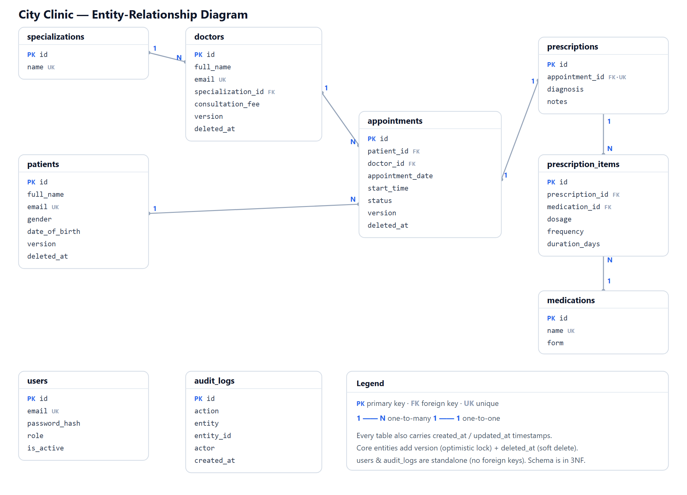
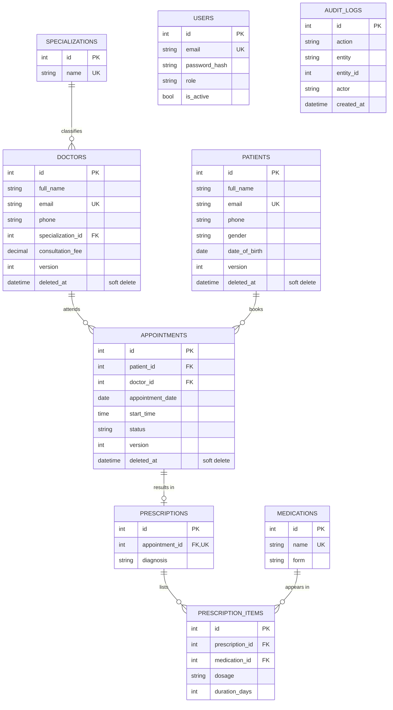
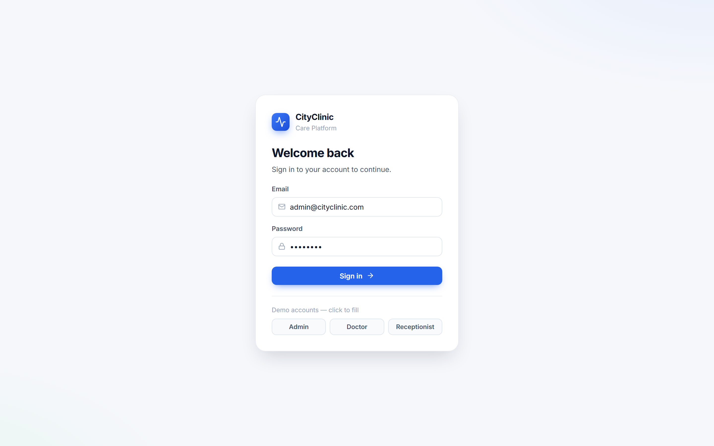
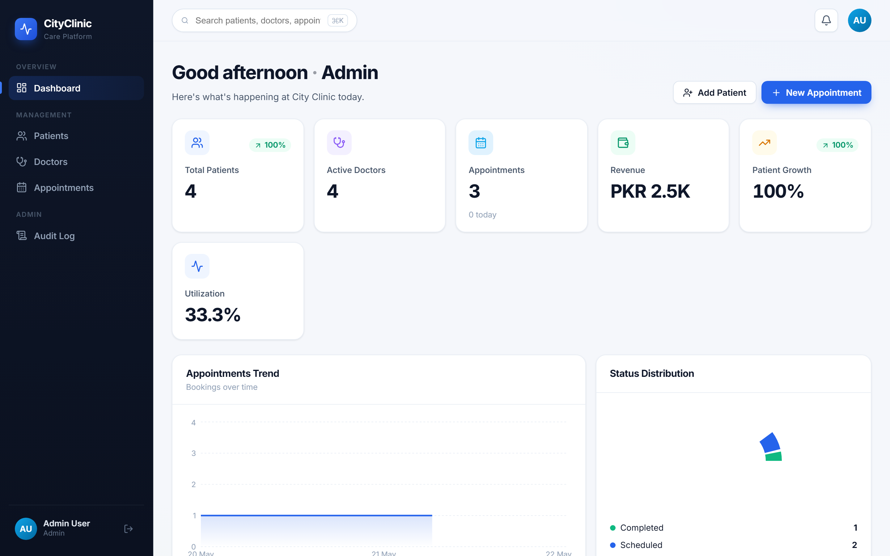
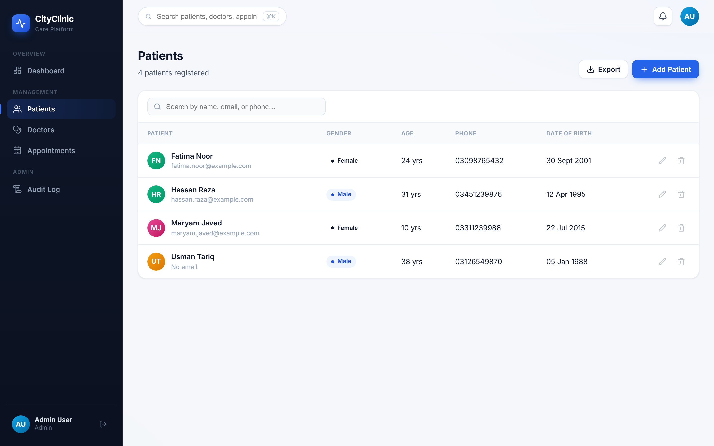
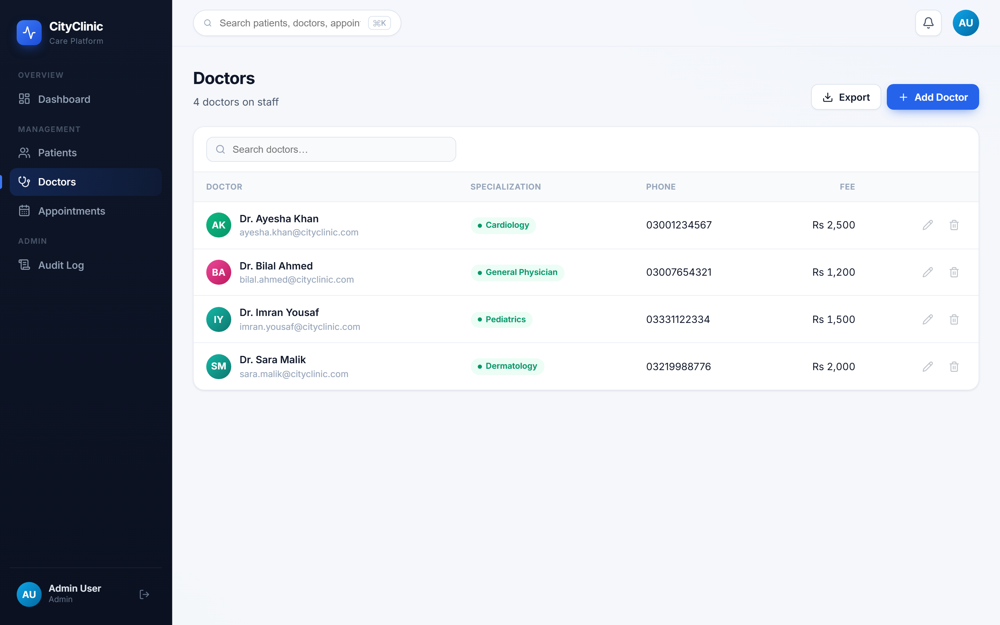
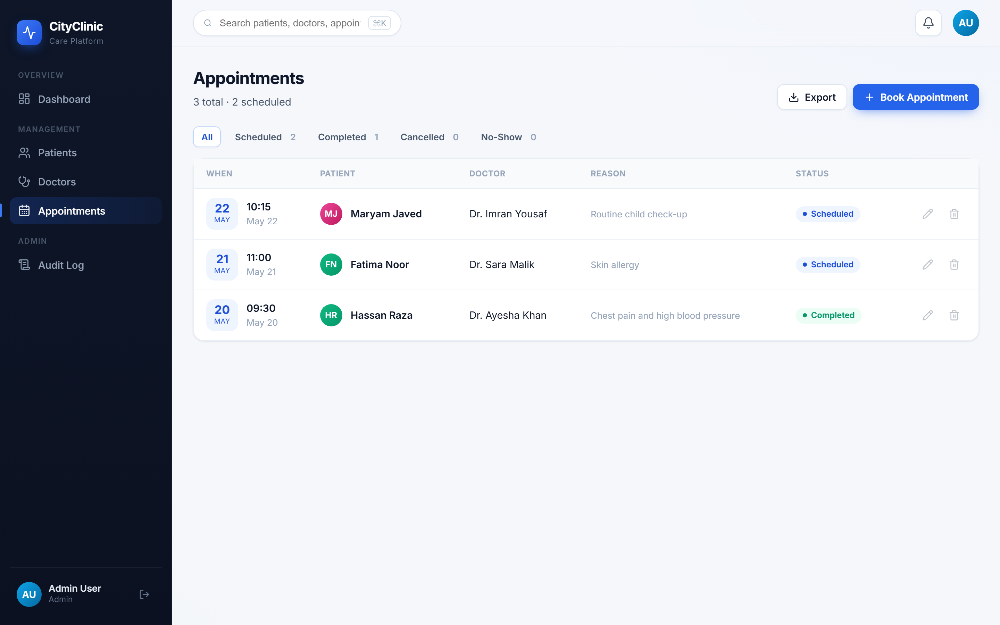
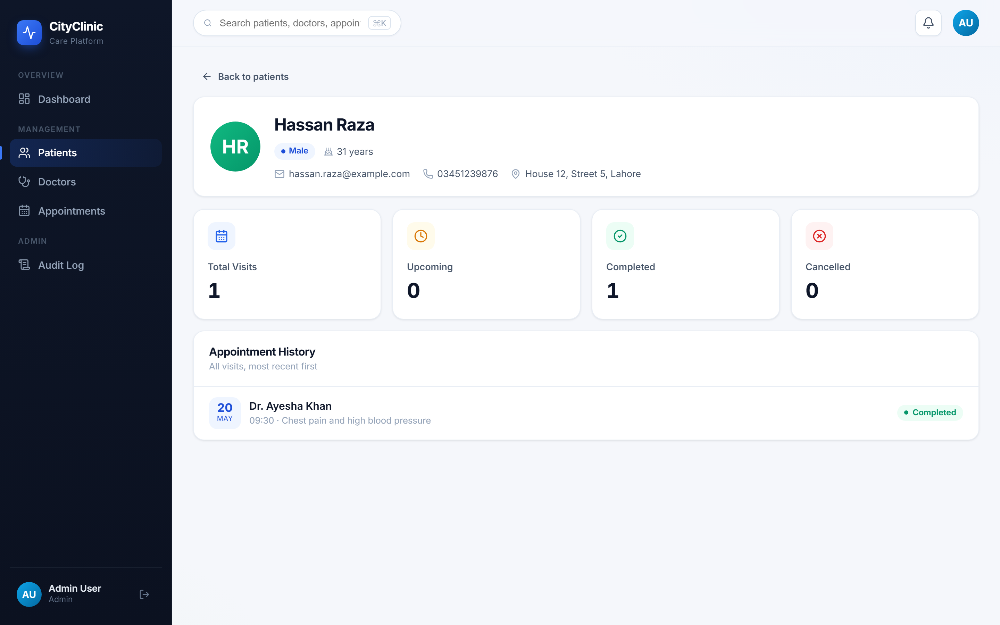
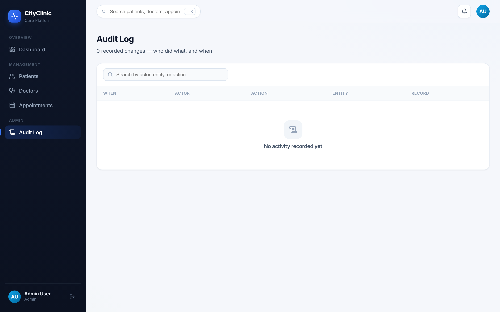

# CSE-403L DBMS Lab — CQI Open-Ended Laboratory Activity

**Project Title:** City Clinic — Care Platform (Appointment Management System)
**Student Name:** Hashir Islam
**Roll No.:** 22PWCSE2192
**Submitted to:** Engr. Summayea Salahuddin
**Date:** 20 June 2026

---

## 1. Problem Statement & Motivation

Small and mid-sized clinics still manage patient visits using paper registers or
ad-hoc spreadsheets, which causes real problems:

- **Double-booking** — two patients given the same doctor at the same time.
- **Lost / inconsistent records** — contact details and visit history duplicated and
  contradicting each other.
- **No accountability** — no record of who changed what, and no access control over
  sensitive patient data.
- **No overview** — staff cannot quickly answer "how many appointments are scheduled
  today?" or "what is this month's revenue?".

**Motivation.** These are fundamentally *data* problems caused by storing information
without integrity rules, access control, or an audit trail. I therefore built **City
Clinic — Care Platform**, a database-driven web application that stores patients,
doctors and appointments in a **normalized, audited relational database**, secured with
**authentication and role-based access**, and exposes it through a clean, responsive
interface.

### Engineering factors considered

| Factor | How the project addresses it |
| ------ | ---------------------------- |
| **Design constraints** | Schema normalized to 3NF; PK/FK/UNIQUE/CHECK/NOT-NULL constraints; soft delete, version (optimistic locking) and audit columns; indexes on every foreign key and frequently-filtered column. |
| **Cost-effectiveness** | 100% open-source stack; efficient queries with eager loading (no N+1); pagination so large datasets are never loaded at once; in-memory caching of hot aggregates. |
| **Sustainability** | Strict layered architecture (routers → services → repositories) so logic is isolated and testable; reusable React component library; database-agnostic via SQLAlchemy; Alembic migrations for safe schema evolution. |
| **User safety** | JWT authentication + role-based access control; bcrypt-hashed passwords; validation on client **and** server; constraints that make invalid/conflicting data impossible; an immutable audit trail recording who did what. |

---

## 2. System Architecture

The application is a **three-tier system** with a strictly layered backend.

```
 React SPA  ──HTTP/JSON (Bearer token)──►  FastAPI backend  ──SQL──►  PostgreSQL / SQLite
 (pages,                                   routers  (HTTP only)
  components,                              services (business rules)
  auth context)                           repositories (data access)
                                          core: config · auth · logging · cache · errors
```

- **Routers** handle HTTP only (parse request, return the response envelope).
- **Services** hold all business rules (validation, conflict handling, audit, auth).
- **Repositories** are the only layer that touches the database (pagination, search,
  sorting, soft-delete filtering).
- **Cross-cutting concerns** live in `core/` and `middleware/`: configuration,
  structured logging, centralized exception handling, JWT/RBAC, rate limiting and caching.

This separation means each layer can be understood, tested and changed independently —
the basis of the project's sustainability and testability.

---

## 3. ER Diagram & Database Schema

### 3.1 Entity-Relationship Diagram



> The same schema is also expressed as editable Mermaid source below (renders on GitHub):



> `USERS` (authentication) and `AUDIT_LOGS` (audit trail) are standalone tables — the
> audit log references entities by name + id rather than by foreign key so it remains
> valid even after a row is removed. Every table also carries `created_at` / `updated_at`
> timestamps (omitted above for readability). Paste this block into
> <https://mermaid.live> to export a PNG/SVG for the printed report.

### 3.2 Relationships (cardinality)

- One **specialization** has many **doctors** (1 : N).
- One **doctor** and one **patient** each have many **appointments** (1 : N) — together the
  `appointments` table resolves the **many-to-many** relationship between patients and doctors.
- One **appointment** produces at most one **prescription** (1 : 1).
- **Prescriptions** and **medications** form a **many-to-many** relationship, resolved by the
  `prescription_items` junction table (carrying dosage, frequency, duration).

### 3.3 Normalization (3NF preserved)

| Form | Requirement | How it is satisfied |
| ---- | ----------- | ------------------- |
| **1NF** | Atomic values, no repeating groups | Every column holds a single value; a patient's many appointments are rows in `appointments`, never repeated columns. |
| **2NF** | No partial dependency | Single-column surrogate primary keys (`id`) everywhere — no partial-key dependencies. |
| **3NF** | No transitive dependency | Specialization and medication names are factored into lookup tables; audit/timestamp/version columns describe the row itself, so 3NF is preserved. |

### 3.4 Data-integrity & hardening features

- **Primary keys** on every table; **indexes** on all foreign keys and on
  `status`, `appointment_date`, `deleted_at`, and audit `entity`.
- **Foreign keys** with deliberate `ON DELETE` behaviour (patient → appointments cascades;
  doctor is `RESTRICT`).
- **UNIQUE** on emails, lookup names, and the composite
  `(doctor_id, appointment_date, start_time)` — the rule that **prevents double-booking**.
- **CHECK** constraints: `gender`, appointment `status`, `role`, `date_of_birth <= today`,
  `consultation_fee >= 0`, `duration_days > 0`.
- **Timestamps** (`created_at`, `updated_at`) on every table.
- **Soft delete** (`deleted_at`) — records are hidden, never destroyed, preserving history.
- **Version tracking** — a `version` column provides optimistic locking against concurrent edits.
- **Audit log** — an immutable `audit_logs` table records every mutation with the acting user.

The full DDL is in [`backend/schema.sql`](backend/schema.sql); migrations are in
[`backend/alembic/`](backend/alembic).

---

## 4. Security & Access Control

- **Authentication:** users log in with email + password; passwords are stored as
  **bcrypt** hashes. A successful login returns a **JWT** (signed, expiring) that the
  client sends as a `Bearer` token on every request.
- **Authorization (RBAC):** three roles with least-privilege access —

  | Capability | Admin | Receptionist | Doctor |
  | ---------- | :---: | :----------: | :----: |
  | View data / dashboard | ✓ | ✓ | ✓ |
  | Manage patients | ✓ | ✓ | — |
  | Manage doctors | ✓ | — | — |
  | Book / update appointments | ✓ | ✓ | ✓ |
  | View audit log | ✓ | — | — |

- **Accountability:** every create/update/delete is written to the audit log together
  with the authenticated user's identity.
- **Defence in depth:** validation on client and server, DB constraints, rate limiting,
  and a consistent error envelope that never leaks internals.

---

## 5. Technology Stack Justification

| Choice | Why |
| ------ | --- |
| **PostgreSQL** | Mature open-source RDBMS with strong constraint, transaction and concurrency support — exactly what is needed to guarantee no double-bookings. Free (cost-effectiveness). |
| **FastAPI (Python)** | Minimal boilerplate, declarative Pydantic validation (user safety), and auto-generated interactive docs. Its dependency-injection model made layering and RBAC clean. |
| **SQLAlchemy + Alembic** | Same code runs on SQLite (instant demo) or PostgreSQL (production) via one env var; Alembic provides safe, versioned schema migrations (sustainability). |
| **React + Vite** | Component-based, reusable UI; code-split, fast dev server and optimized build. Framer Motion + Recharts deliver a polished, data-rich experience. |
| **JWT + bcrypt** | Stateless, standard authentication; bcrypt is the industry standard for password hashing. |

**Alternatives considered.** A MERN stack was rejected because MongoDB is
non-relational, making normalization and referential integrity (core DBMS-lab criteria)
awkward to demonstrate. A relational stack is the natural fit for a problem that is
fundamentally about relationships and constraints.

---

## 6. API Design

The API is REST-consistent and self-documenting. Every response uses a single envelope:

```json
{ "success": true, "message": "Patient created", "data": { ... } }
```

List endpoints are paginated and add a `meta` block, and accept `page`, `page_size`,
`sort`, `order` and `q` (search). Errors are uniform and machine-readable:

```json
{ "success": false, "message": "Validation failed", "code": "VALIDATION_ERROR",
  "errors": [ { "field": "gender", "message": "gender must be Male, Female, or Other" } ] }
```

Interactive documentation is generated at `/docs`, organized by tags, with an
*Authorize* button for the bearer token.

---

## 7. UI Screenshots & Feature Descriptions

> Screenshots of the running application.

**7.1 Login** — JWT sign-in with role-based demo accounts.



**7.2 Dashboard** — KPI cards (patients, doctors, revenue, growth, utilization) and live
charts (appointment trend, status distribution, doctor workload), upcoming appointments
and recent activity.



**7.3 Patients** — premium data table with search, sort, CSV export and an avatar per
patient; the modal form validates inputs inline.



**7.4 Doctors** — doctors with their specialization (from a lookup table) and consultation
fee; managing doctors is restricted to Admins.



**7.5 Appointments** — bookings joined with patient and doctor, status filters and badges;
the booking form performs live double-booking detection.



**7.6 Patient profile** — avatar header, stat cards (visits, upcoming, completed,
cancelled) and the full appointment history.



**7.7 Audit Log (Admin only)** — every change recorded with actor, action, entity and time.



---

## 8. Testing

An automated test suite (`backend/tests/`, run with `pytest`) verifies behaviour against
an isolated in-memory database:

- authentication (login, `/me`, wrong password → 401),
- access control (unauthenticated → 401, role violation → 403),
- CRUD and input validation (422 with field-level errors),
- pagination and search,
- double-booking prevention (409),
- soft delete + audit-trail recording.

All tests pass. This gives confidence that the data-integrity rules hold and protects
against regressions.

---

## 9. Challenges Faced & How They Were Resolved

| Challenge | Resolution |
| --------- | ---------- |
| **Enforcing double-booking prevention at the database level**, not just the UI. | Composite `UNIQUE (doctor_id, appointment_date, start_time)`; the service catches the integrity error and returns a friendly `409` — and the booking form detects the clash live. |
| **Recording *who* made each change.** | An `audit_logs` table plus an audit service; the authenticated user's identity is threaded from the JWT into every create/update/delete. |
| **Deleting data without losing history.** | Soft delete: a `deleted_at` column; the repository layer transparently filters hidden rows from all queries. |
| **Keeping the frontend working while overhauling the API** to a `{success, data}` envelope and pagination. | A thin API wrapper unwraps the envelope in one place, so page components were largely untouched. |
| **Resilient UI under API failure.** | React error boundaries and graceful retry states so a single failed request never white-screens the app. |
| **`create_all` vs. Alembic migrations.** | Kept `create_all` for zero-setup dev and used Alembic for the production migration path, documenting `alembic stamp head` for existing databases. |

---

## 10. Reflection & Future Improvements

**Reflection.** This project reinforced that application reliability rests on the
*database design* far more than the UI: duplicate patients, double-bookings and
impossible data are all prevented by normalization and constraints. Layering the backend
(routers → services → repositories) made the system genuinely maintainable and testable,
and adding authentication, an audit trail and soft delete turned a CRUD app into
something that resembles a real product.

**Future improvements:**

- **Availability-aware scheduling** — validate slots against each doctor's working hours.
- **Prescription management UI** (the schema and API foundations already exist).
- **Full WCAG AA accessibility audit** (the basics — semantic markup, labels, focus,
  reduced-motion — are already in place).
- **Email/SMS appointment reminders.**
- **Containerized deployment** with Docker Compose (API + PostgreSQL + built frontend).

---

## 11. CLO Mapping

| CLO | Evidence in this project |
| --- | ------------------------ |
| **CLO-1 / PLO-1** — use the stack to develop & deploy a DB app; justify a normalized schema. | §2 architecture, §3 normalized 3NF schema + constraints + migrations, §5 stack justification. |
| **CLO-2 / PLO-5** — implement a UI with CRUD and good UX. | §7 — responsive React UI with full CRUD, search/sort/pagination, profiles, validated inputs, animations and clear error handling. |

## 12. Deliverables Checklist

- [x] **Source code** — `backend/` and `frontend/` (zip or GitHub link).
- [x] **Database script** — `backend/schema.sql` (PostgreSQL DDL) + `backend/alembic/` migrations.
- [x] **Automated tests** — `backend/tests/` (pytest).
- [x] **Lab report** — this document (schema, ER diagram, screenshots and analysis).
